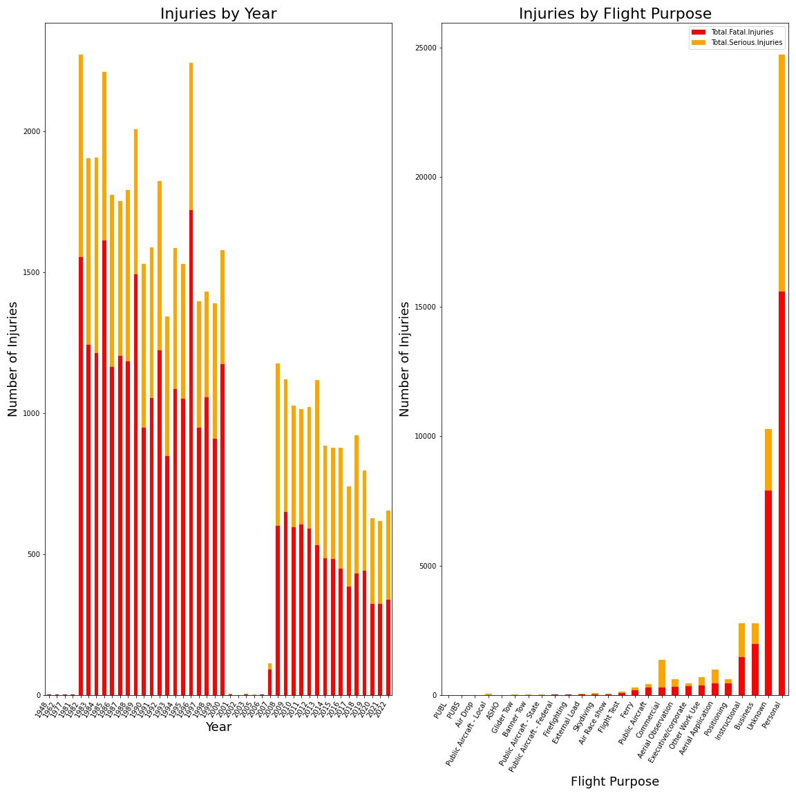
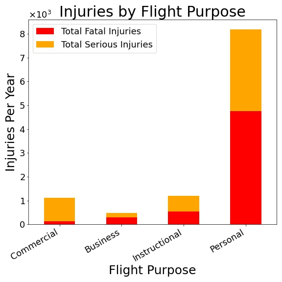
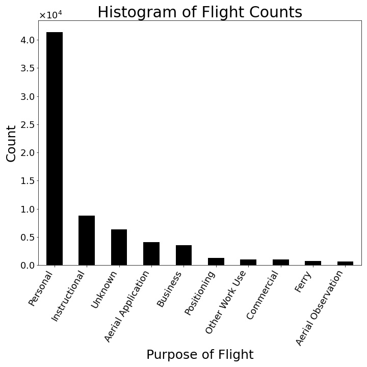
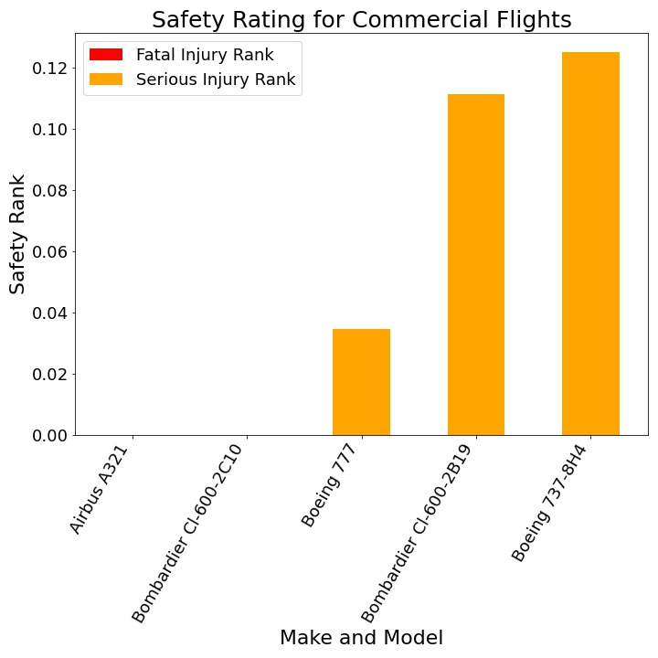
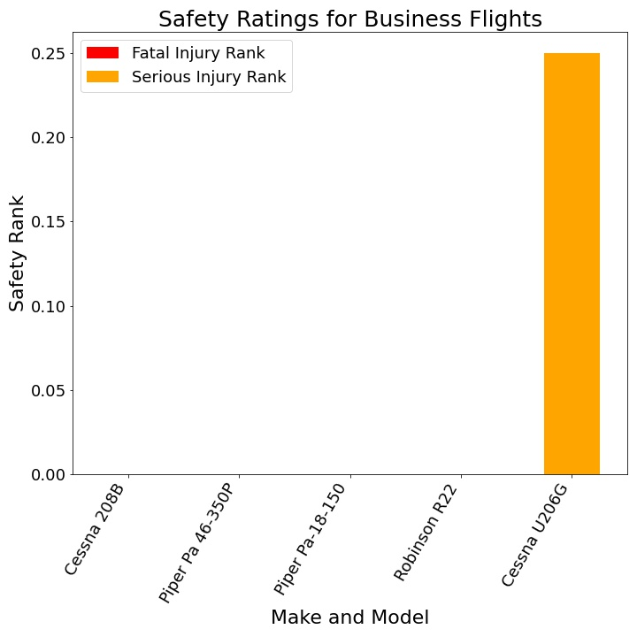
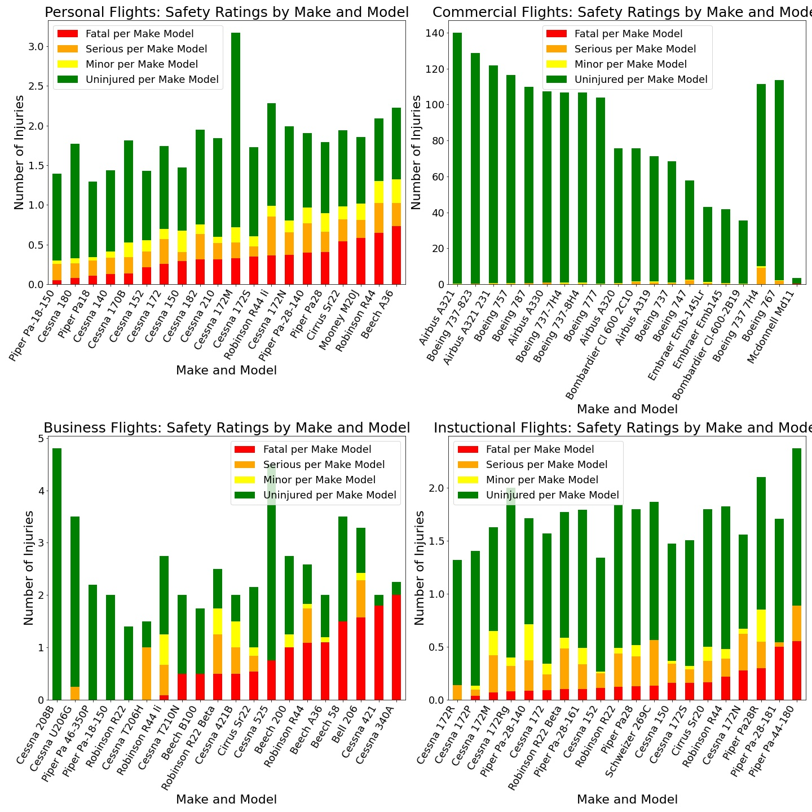

## Project Overview

For this project, we'll use data cleaning, imputation, analysis, and visualization to generate insights for a business stakeholder. We'll be using Python's Pandas for data manipulation and Matplotlib for visualizations.

## Business Understanding

Stakeholders's company is expanding into new industries to diversify its portfolio. Specifically, they are interested in purchasing and operating airplanes for commercial and private enterprises but do not know anything about the potential risks of aircraft. We are charged with determining which aircraft are the lowest risk for the company to start this new business endeavor. We'll translate findings into actionable insights that the head of the new aviation division can use to help decide which aircraft to purchase.

##  Data Understanding and Analysis

### Source of Data
We'll be using [dataset](https://www.kaggle.com/datasets/khsamaha/aviation-accident-database-synopses) from the National Transportation Safety Board that includes aviation accident data from 1962 to 2023 about civil aviation accidents and selected incidents in the United States and international waters. The data has no copyright, meaning that we can copy, modify, distribute and perform the work, even for commercial purposes, all without asking permission.

## Description of Data

The data comes from National Transportation Safety Board aviation accident [dataset](https://www.ntsb.gov/Pages/AviationQueryV2.aspx).
The accident data has been in collecion since the 40s. During the decades the dataset schema changed: new variables got added, some variables stoppped being reported.

### Data Cleaning

We're going to perform initial cleaning to get rid of duplicates in Make and Model. 
We'll use column with FAR description codes to identify commercial flights and update information in column describng Purpose of the Flight. We'll aso clean up Latitude and Longitude by converting it from DMS to degrees.

### Selecting Relevant Columns

We'll be using columns describing injury count and type, columns describing make and model, date, and purpose of the flight to determine the additional filtering.

### Unfiltered Historical Data

After displaying the historical data, we'll apply additional filtering: use years after 2006 and analyze the top 4 categories of flying: Personal, Commercial, Business, Instructional. 

### Filtered Historical Data

### Safety Risks in the Context of Available Data 
The dataset contains only reported accidents and does not contain the crucial information: total number of flights per make per model. We'll be using the make and model's avg fatal and serious injuries instead.

### Most Frequent Flying Purposes.
The top-10 most frequent flying purposes are:

We'll focus safety analysis on Personal, Business, Instructional as well as commercial, its not the most frequent but is within our business task.

### Safety Ratings for Four Most Frequent Flight Purposes

## Conclusion
Here are the top 5 recommended aircrafts 

| Commercial          | Business               | Instructional         |
|---------------------|------------------------|------------------------|
| Airbus A321         | Cessna 208B            | Cessna 172R            |
| Boeing 777          | Piper Pa 46-350P       | Cessna 172P            |
| Bombardier CL 600   | Piper Pa-18-150        | Cessna 172M            |
| Boeing 737          | Robinson R22           | Cessna 172Rg           |
| Boeing 737          | Cessna U206G           | Piper Pa-28-140        |
